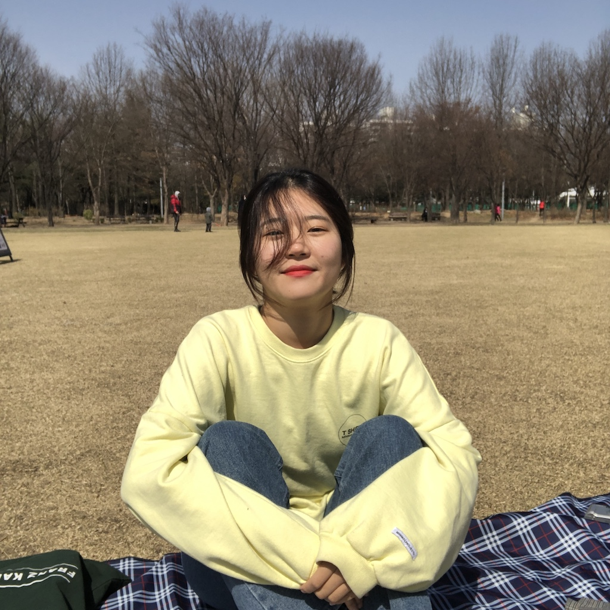

# 정의정 (uiui)

우리 삶의 스마트화를 이끄는 인공지능 소프트웨어를 개발하고 싶은 학생입니다. 저는 소통을 중시하고 열정적인 팀 프로젝트를 지향합니다.

  
|  | 👩‍🎓Senior /   💻 Department of CSE at DGU /   📚Python / ML / DL /   📍Back-end Engineer |
| :-------------------------------: | ------------------------------ |
|            **GitHub**             | <https://github.com/Uijeong97> |
|             **Blog**              | <https://uiui.blog>            |
|           **Contact**             | <uiui_97@naver.com>            |

 

# Technical Skills

주언어는 Python이고, 그 이외의 언어들은 자유도 순으로 나열하였습니다. 모르는게 생기면 서치해서 바로바로 해결 할 수 있는 수준입니다.
프레임워크는 아직 초급 수준입니다. 프로젝트에서 필요한 부분을 구글링을 통해 해결한 수준입니다. 더 배워서 메꿔나가고 싶습니다. 

|                                   |                                         |
| :-------------------------------: | --------------------------------------- |
|    **Programming Languages**      | Python, C++, Swift, Javascripts, Java   |
|          **Frameworks**           | Node.js, Ionic, Tensorflow              |
|             **IDEs**              | Pycharm, VS Code, Xcode, Eclipse         |
|           **Database**            | MySQL(Oracle)                           |
|            **Others**             | Git & Github, AWS, Google Cloud Service |

이외에....

Good Communication Skills 😊

Leadership & Teamwork! 👩‍👩‍👧‍👧

 

# Projects

### EBS 교재 출판 수요 예측 (비정형 데이터 전처리 및 분석 담당)

EBS와 산학협력으로 진행한 교재의 출판 수요를 예측하는 프로젝트.

* 18.07 ~ 18.09
* Scikit-Learn
* Team Leader (12명이 참여하는 해당 프로젝트 총괄)
* 한국교육방송공사 표창장

#### Description

* 데이터 수집 체계화
    - 정형/비정형으로 데이터 수집 팀을 나누어 진행
    - 비정형 데이터 수집을 맡았으며, 파이썬 라이브러리 BeautifulSoup 사용하여  수험생 커뮤니티 3곳의 크롤러를 만듬. 날짜와 교재, 과목을 선택하면 정리된 형태로 csv 파일에 수집할 수 있도록 체계화함.
    - 리뷰학습을 위해 알라딘 등 수험서 사이트에서 수험서 리뷰 크롤러 생성
* 감성분석 과정 전, 데이터 특성 파악해 데이터 전처리 과정 도입
    - 수집한 데이터에는 교재에 대한 리뷰 및 질문글들이 대부분을 차지. 이를 교재에 대한 리뷰/질문인지 분류하기 위한 분류기 생성. (테스트 정확도 90% 성능을 보임)
* 감성분석(긍/부정) 모델 구축
    - 리뷰로 분류된 데이터를 긍/부정으로 분류하기 위한 분류기 생성. (테스트 정확도 86% 성능을 보임)
    - 리뷰분류기 도입 전 테스트 정확도 60%에서 도입 후 86.1%로 향상.
* 코드 리펙토링으로 수집-분석 과정 자동화
    - 사이트, 날짜와 교재, 과목을 선택하면 데이터 수집-리뷰분류-감성분석 과정을 거쳐 교재에 대한 반응을 수치화함. (데이터 수집부터 가공하는 과정을 자동화)

 

### Purdue University 무인 군용 드론 프로젝트 (드론 제어파트 담당)

미국 퍼듀 대학교에서 진행한 캡스톤 디자인.

* 19.07 ~ 19.08
* Raspberry Pi3, GPIO, Python
* IEEE IRC 2020 논문 게재

#### Description

* 프로젝트 초기 Stealth UAV를 위한 드론 설계
    - Stealth 기능 최적화를 위해 유체역학 효과 도입한 드론 설계
    - 하드웨어/소프트웨어로 팀을 나눠 진행
* 드론 제어를 위한 서버구축
    - os 설치 및 환경설정 후, 고정IP 할당. RDP 방식으로 라즈베리파이를 컴퓨터에서 제어할 수 있도록 함.
* 코드 리펙토링으로 센서/모터 모듈화
    - 센서/모터를 라즈베리파이 GPIO에 연결하고, 각각의 데이터를 받아오고 모터를 제어하는 코드 작업을 함.
    - 이 과정에서 클래스화하여 메인에서 모듈을 임포트하는 방식으로 코드 작업 후, 키 인터럽트로 드론 제어.
* Stealth 관련 연구 지속하여 IEEE IRC 2020 논문 게재
    - Dongyoon Shin, Hyeji Kim, Jihyuk Gong, Uijeong Jeong, Yeeun Jo and Eric Matson, "Stealth UAV through Coandă Effect", IEEE IRC 2020

 

### 인공지능 홈 트레이닝 서비스 Home PT (Full-Stack 담당)

제 4회 SW 공모대전 준비를 위해 진행한 인공지능 운동 자세코칭 서비스.

* 19.10 ~ 19.12
* Tensorflow, Python, Swift(Application)
* 싱가폴 국립대학 NUS 발표

#### Description

* Pose Estimation Model 개선
    - 기존 Pose Estimation Model의 관절 꼬임 문제를 Refine Function을 도입해 개선
* Feedback Algorithm 개발
    - Posture에 대한 피드백은 추출된 관절 바탕으로 로직 구현.
    - Speed에 대한 피드백은 Ground Truth 분포를 형성하고 로직 구현.
* iOS 어플리케이션 개발
    - 사용자 운동 데이터를 모티베이션 증진을 위한 어플리케이션 개발.

 

# Activities

### ✅ 동국대학교 팜시스템 회장

|  |      |
| :--: | :--: |
| **Period** | 18.04 ~ 18.12 |
| **Description** | 동국대 산학협력 SW 교육 모델 팜시스템 1기 회장 |

 

### ✅ 시각장애인을 위한 e-book 플랫폼 연구
|  |      |
| :--: | :--: |
| **Period** | 18.09 ~ 18.11 |
| **Description** | 텍스트마이닝 측면에서 연구하여 특허출원 및 기술이전. |

 

### ✅ Hi-SW 봉사단에서 1년간 활동
|  |      |
| :--: | :--: |
| **Period** | 18.12 ~ 19.12 |
| **Description** | 저소득층 아이들과 중학교 아이들에게 SW 교육. |

 

### ✅ 동국대학교 빅데이터 팜 회장

|  |      |
| :--: | :--: |
| **Period** | 19.01 ~ 19.12 |
| **Description** | 동국대 팜시스템 빅데이터 팜 2기 회장 |

 

### ✅ 소프트웨어 마에스트로 11기

|  |      |
| :--: | :--: |
| **Period** | 20.05 ~ 진행중 |
| **Description** | 소프트웨어 마에스트로 11기 연수생, 공부하고 노력하며 발전하자! |

 

# Awards and Honors

* EBS 수능교재 출판수요 예측 프로젝트 / 표창장 / 2018년 10월 24일 / 한국교육방송공사 사장 장해랑
* IITP-Purdue Summer Program 2019 / Certificate of Merit / 2019년 8월 / Purdue University Eric T. Matson Professor
* 제 4회 동국 SW 공모대전 / 금상 / 2019년 11월 27일 / 동국대학교 융합교육원 원장 이강우
* FARM ICT 아이디어 경진대회 / 우수상 / 2019년 11월 27일 / 동국대학교 융합교육원 원장 이강우
* 제 12회 TOPCIT 정기 평가 / 우수상(전체 상위 10% 이내 수혜) / 2019년 12월 12일 / 동국대학교 융합교육원 원장 이강우
