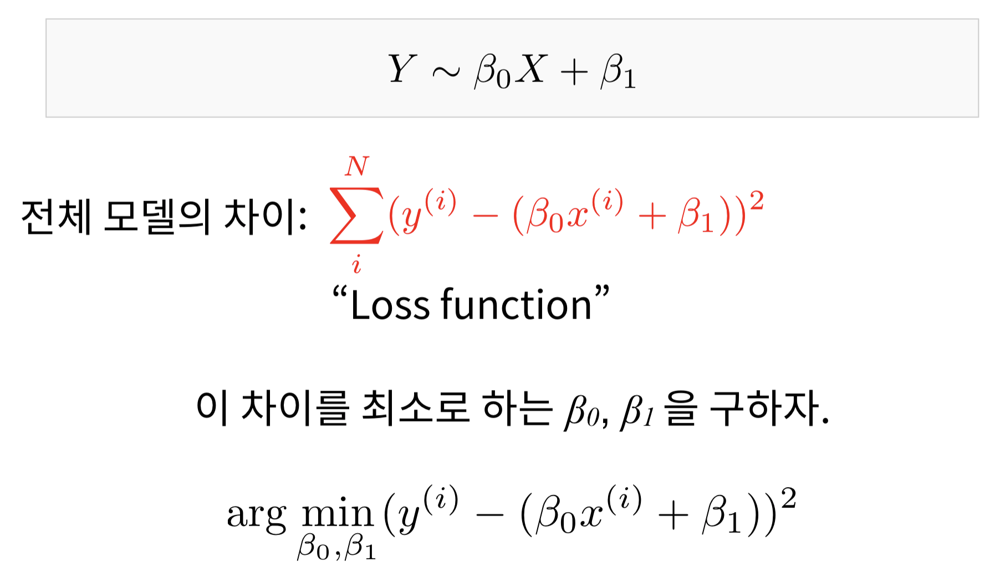
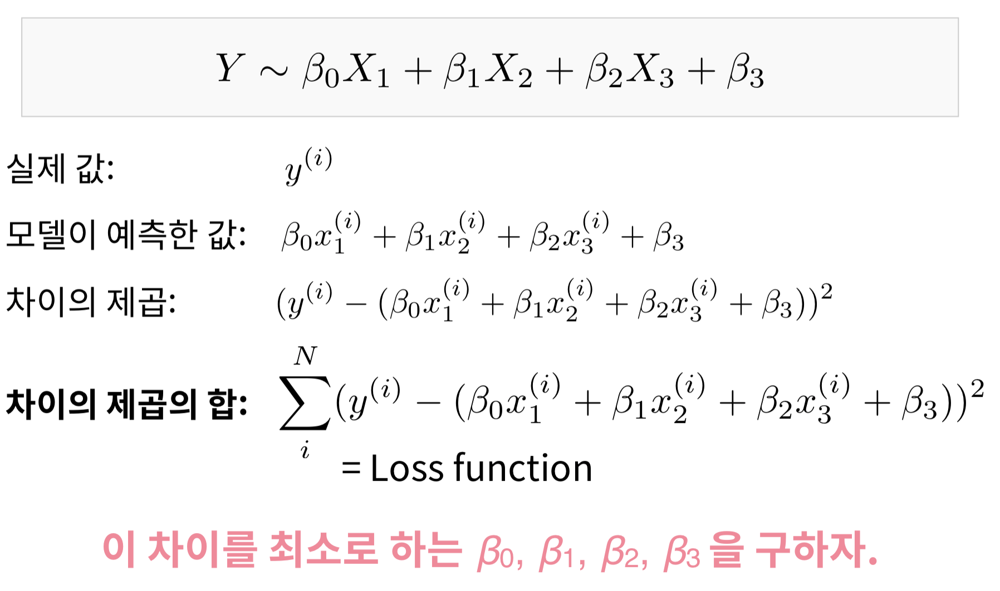
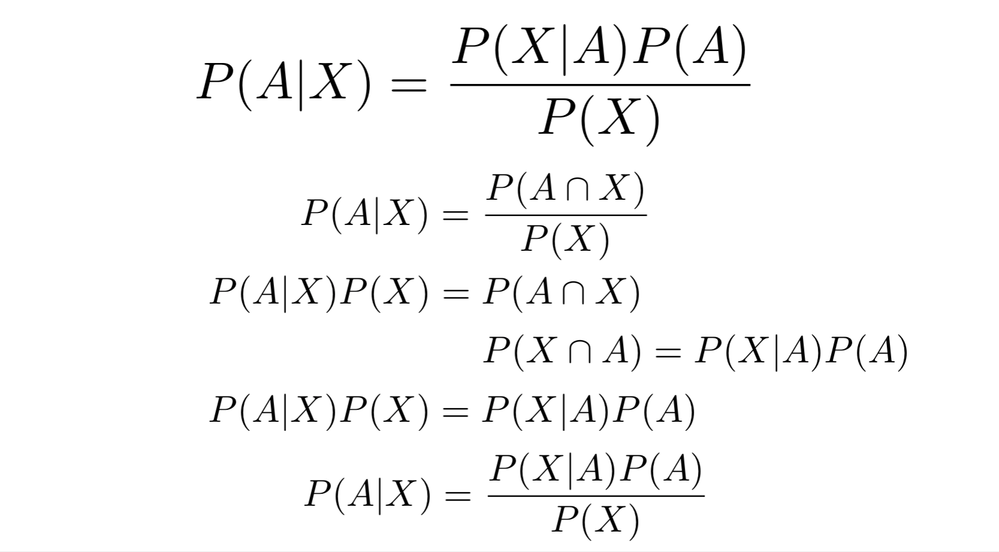
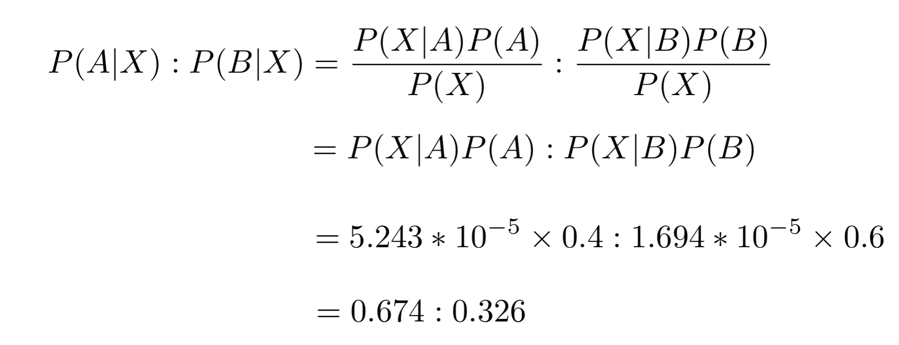

# 목차
1. 선형대수학, Numpy (생략)
2. [회귀 분석]()
3. [나이브 베이즈 분류]()
4. [K-Means 클러스터링]()


# 2. 회귀 분석

## 📌 **1. 회귀분석이란?**

* 데이터를 가장 잘 설명하는 선(함수)를 찾아 새로운 데이터가 어떤 결과값을 가질지 예측하는 것

## 📌 **2. Loss Function**

* 데이터를 완벽하게 표현하는 예측을 하는 것은 불가능
* 전체 모델의 차이를 최소로 하는 β0, β1을 구하자



### 실습

```python
def loss(x, y, beta_0, beta_1):
    N = len(x)
    
    '''
    x, y, beta_0, beta_1 을 이용해 loss값을 계산한 뒤 리턴합니다.
    '''
    x = np.array(x)
    y = np.array(y)
    return np.sum((y - (beta_0 * x + beta_1)) ** 2)
```

## 📌 **3. 산 정상 오르기**

* 데이터를 가장 잘 설명하는 β0, β1을 구하기 위해, 예측 값과 실제 값의 차이를 최소로 만드는 값을 구해야함. 즉, Loss function을 최소로 만드는 β0, β1을 구해야함.
* Loss function의 경사가 가장 가파르게 감소하는 방향을 찾는 것이 핵심


### Scikit-learn을 이용한 회귀분석

```python
import matplotlib as mpl
mpl.use("Agg")
import matplotlib.pyplot as plt
import numpy as np
from sklearn.linear_model import LinearRegression

def loss(x, y, beta_0, beta_1):
    N = len(x)
    
    '''
    이전 실습에서 구현한 loss function을 여기에 붙여넣습니다.
    '''
    x = np.array(x)
    y = np.array(y)
    total_loss = np.sum((y - (beta_0 * x + beta_1) ** 2))

    return total_loss
    
X = [8.70153760, 3.90825773, 1.89362433, 3.28730045, 7.39333004, 2.98984649, 2.25757240, 9.84450732, 9.94589513, 5.48321616]
Y = [5.64413093, 3.75876583, 3.87233310, 4.40990425, 6.43845020, 4.02827829, 2.26105955, 7.15768995, 6.29097441, 5.19692852]

train_X = np.array(X).reshape(-1, 1)
train_Y = np.array(Y)

'''
여기에서 모델을 트레이닝합니다.
'''
lrmodel = LinearRegression()
lrmodel.fit(train_X, train_Y)

'''
loss가 최소가 되는 직선의 기울기와 절편을 계산함
'''
beta_0 = lrmodel.coef_[0]   # lrmodel로 구한 직선의 기울기
beta_1 = lrmodel.intercept_ # lrmodel로 구한 직선의 y절편

print("beta_0: %f" % beta_0)
print("beta_1: %f" % beta_1)
print("Loss: %f" % loss(X, Y, beta_0, beta_1))

plt.scatter(X, Y) # (x, y) 점을 그립니다.
plt.plot([0, 10], [beta_1, 10 * beta_0 + beta_1], c='r') # y = beta_0 * x + beta_1 에 해당하는 선을 그립니다.

plt.xlim(0, 10) # 그래프의 X축을 설정합니다.
plt.ylim(0, 10) # 그래프의 Y축을 설정합니다.
```

## 📌 **4. 다중선형회귀분석(Multiple Linear Regression)**

* Feature가 여러개, output이 1개인 회귀분석
* Feature가 여러개인 선형적 관계로 가정
* 각 데이터의 실제값과 예측값의 차이를 최소한으로 만든다.



### 실습

```python
import numpy as np
from sklearn.linear_model import LinearRegression
from sklearn.metrics import r2_score

'''
./data/Advertising.csv 에서 데이터를 읽어, X와 Y를 만듭니다.

X는 (200, 3) 의 shape을 가진 2차원 np.array,
Y는 (200,) 의 shape을 가진 1차원 np.array여야 합니다.

X는 FB, TV, Newspaper column 에 해당하는 데이터를 저장해야 합니다.
Y는 Sales column 에 해당하는 데이터를 저장해야 합니다.
'''

import csv
csvreader = csv.reader(open("data/Advertising.csv"))

x = []
y = []

next(csvreader)
for line in csvreader :
    x_i = [ float(line[1]), float(line[2]), float(line[3]) ]
    y_i = float(line[4])
    x.append(x_i)
    y.append(y_i)

X = np.array(x)
Y = np.array(y)

lrmodel = LinearRegression()
lrmodel.fit(X, Y)

beta_0 = lrmodel.coef_[0] # 0번째 변수에 대한 계수 (페이스북)
beta_1 = lrmodel.coef_[1] # 1번째 변수에 대한 계수 (TV)
beta_2 = lrmodel.coef_[2] # 2번째 변수에 대한 계수 (신문)
beta_3 = lrmodel.intercept_ # y절편 (기본 판매량)

print("beta_0: %f" % beta_0)
print("beta_1: %f" % beta_1)
print("beta_2: %f" % beta_2)
print("beta_3: %f" % beta_3)

def expected_sales(fb, tv, newspaper, beta_0, beta_1, beta_2, beta_3):
    '''
    FB에 fb만큼, TV에 tv만큼, Newspaper에 newspaper 만큼의 광고비를 사용했고,
    트레이닝된 모델의 weight 들이 beta_0, beta_1, beta_2, beta_3 일 때
    예상되는 Sales 의 양을 출력합니다.
    '''
    result = beta_0 * fb + beta_1 * tv + beta_2 * newspaper + beta_3
    return result

print("예상 판매량: %f" % expected_sales(10, 12, 3, beta_0, beta_1, beta_2, beta_3))
```

## 📌 **5. 다항식회귀분석(Polynomial Linear Regression)**

* 선형관계가 아닌 문제를 풀기 위함


### 실습1
```python
import numpy as np
import pandas as pd
from sklearn.linear_model import LinearRegression
from sklearn.metrics import mean_squared_error
from sklearn.model_selection import train_test_split

'''
./data/Advertising.csv 에서 데이터를 읽어, X와 Y를 만듭니다.

X는 (200, 3) 의 shape을 가진 2차원 np.array,
Y는 (200,) 의 shape을 가진 1차원 np.array여야 합니다.

X는 FB, TV, Newspaper column 에 해당하는 데이터를 저장해야 합니다.
Y는 Sales column 에 해당하는 데이터를 저장해야 합니다.
'''
data = pd.read_csv('data/Advertising.csv')
print(data.describe())
import csv
csvreader = csv.reader(open('data/Advertising.csv'))
x = []
y = []

next(csvreader)
for line in csvreader:
    x_i = [ float(line[1]), float(line[2]), float(line[3]) ]
    y_i = float(line[4])
    x.append(x_i)
    y.append(y_i)
    
X = np.array(x)
Y = np.array(y)

# 다항식 회귀분석을 진행하기 위해 변수들을 조합합니다.
X_poly = []
for x_i in X:
    X_poly.append([
        x_i[0], # X_1^2
        x_i[1], # X_2
        x_i[2], # X_3
        x_i[0] * x_i[1],
        x_i[0] * x_i[2],
        x_i[1] * x_i[2],
        x_i[2] ** 2,
        x_i[1] ** 2,
        x_i[0] ** 2
    ])

# X, Y를 80:20으로 나눕니다. 80%는 트레이닝 데이터, 20%는 테스트 데이터입니다.
x_train, x_test, y_train, y_test = train_test_split(X_poly, Y, test_size=0.2, random_state=0)

# x_train, y_train에 대해 다항식 회귀분석을 진행합니다.
lrmodel = LinearRegression()
lrmodel.fit(x_train, y_train)

#x_train에 대해, 만든 회귀모델의 예측값을 구하고, 이 값과 y_train 의 차이를 이용해 MSE를 구합니다.
predicted_y_train = lrmodel.predict(x_train)
mse_train = mean_squared_error(y_train, predicted_y_train)
print("MSE on train data: {}".format(mse_train))

# x_test에 대해, 만든 회귀모델의 예측값을 구하고, 이 값과 y_test 의 차이를 이용해 MSE를 구합니다. 이 값이 1 미만이 되도록 모델을 구성해 봅니다.
predicted_y_test = lrmodel.predict(x_test)
mse_test = mean_squared_error(y_test, predicted_y_test)
print("MSE on test data: {}".format(mse_test))
```


### 미션2

```python
import operator
from sklearn.linear_model import LinearRegression
import numpy as np
import matplotlib
matplotlib.use('Agg')
import matplotlib.pyplot as plt
import elice_utils


def main():
    words = read_data()
    words = sorted(words, key=lambda x: x[1], reverse=True) # words.txt 단어를 빈도수 순으로 정렬합니다.
    # 정수로 표현된 단어를 X축 리스트에, 각 단어의 빈도수를 Y축 리스트에 저장합니다.  
    X = list(range(1, len(words)+1))
    Y = [x[1] for x in words]
    
    # X, Y 리스트를 array로 변환한 후 각 원소 값에 log()를 적용합니다.
    X, Y = np.array(X).reshape(-1, 1), np.array(Y).reshape(-1, 1)
    X, Y = np.log(X), np.log(Y)
    # 기울기와 절편을 구한 후 그래프와 차트를 출력합니다. 
    slope, intercept = do_linear_regression(X, Y)
    draw_chart(X, Y, slope, intercept)
    
    return slope, intercept


# read_data() - words.txt에 저장된 단어와 해당 단어의 빈도수를 리스트형으로 변환합니다.
def read_data():
    # words.txt 에서 단어들를 읽어, 
    # [[단어1, 빈도수], [단어2, 빈도수] ... ]형으로 변환해 리턴합니다.
    f = open('words.txt', 'r')
    words = []
    while True:
        line = f.readline()
        if not line: break
        word, num = line.strip().split(',')
        words.append([word, int(num)])
    f.close()
    return words


# do_linear_regression() - 임포트한 sklearn 패키지의 함수를 이용해 그래프의 기울기와 절편을 구합니다.
def do_linear_regression(X, Y):
    # do_linear_regression() 함수를 작성하세요. 
    lrmodel = LinearRegression()
    lrmodel.fit(X, Y)
    
    slope = lrmodel.coef_[0]
    intercept = lrmodel.intercept_
    
    return (slope, intercept)


# draw_chart() - matplotlib을 이용해 차트를 설정합니다.
def draw_chart(X, Y, slope, intercept):
    fig = plt.figure()
    ax = fig.add_subplot(111)
    plt.scatter(X, Y)

    # 차트의 X, Y축 범위와 그래프를 설정합니다.
    min_X = min(X)
    max_X = max(X)
    min_Y = min_X * slope + intercept
    max_Y = max_X * slope + intercept
    plt.plot([min_X, max_X], [min_Y, max_Y], 
             color='red',
             linestyle='--',
             linewidth=3.0)
    
    # 기울과와 절편을 이용해 그래프를 차트에 입력합니다.
    ax.text(min_X, min_Y + 0.1, r'$y = %.2lfx + %.2lf$' % (slope, intercept), fontsize=15)
    
    plt.savefig('chart.png')
    elice_utils.send_image('chart.png')

if __name__ == "__main__":
    main()
```


# 3. 나이브 베이즈 분류

## 📌 **1. 확률기초**

### 확률이란
* 어떤 사건이 일어날 것이지 혹은 일어났는지에 대한 지식 혹은 믿음을 표현하는 방법

## 📌 **2. 베이즈 법칙**

```python
import matplotlib as mpl
mpl.use("Agg")
import matplotlib.pyplot as plt
import numpy as np

import elice_utils

def main():
    plt.figure(figsize=(5,5))
    
    X = []
    Y = []
    
    # N을 10배씩 증가할 때 파이 값이 어떻게 변경되는지 확인해보세요.
    N = 10000
    
    for i in range(N):
        X.append(np.random.rand() * 2 - 1)
        Y.append(np.random.rand() * 2 - 1)
    X = np.array(X)
    Y = np.array(Y)
    distance_from_zero = np.sqrt(X * X + Y * Y)
    is_inside_circle = distance_from_zero <= 1
    
    print("Estimated pi = %f" % (np.average(is_inside_circle) * 4))
    
    plt.scatter(X, Y, c=is_inside_circle)
    plt.savefig('circle.png')
    elice_utils.send_image('circle.png')

if __name__ == "__main__":
    main()
```

## 📌 **3. 나이브 베이즈 분류기**

### 빈도주의자 vs 베이즈주의자

**빈도주의자**
* 동전을 수천, 수만 번 던졌을 때 그 중 앞면이 50%, 뒷면이 50% 나온다.

**베이즈주의자**
* 동전 던지기의 결과가 앞면이 나올 것이라는 믿음이 50%이다.

### 베이즈 법칙



### 예제: 암 검사 키트

```python
def main():
    sensitivity = float(input())
    prior_prob = float(input())
    false_alarm = float(input())

    print("%.2lf%%" % (100 * mammogram_test(sensitivity, prior_prob, false_alarm)))

def mammogram_test(sensitivity, prior_prob, false_alarm):
    p_a1_b1 = sensitivity # p(A = 1 | B = 1)

    p_b1 = prior_prob    # p(B = 1)

    p_b0 = 1 - prior_prob    # p(B = 0)

    p_a1_b0 = false_alarm # p(A = 1|B = 0)

    p_a1 = p_a1_b1 * p_b1 + p_a1_b0 * p_b0    # p(A = 1)

    p_b1_a1 = p_a1_b1 * p_b1 / p_a1 # p(B = 1|A = 1)

    return p_b1_a1

if __name__ == "__main__":
    main()
```

### 나이브 베이즈 분류기

**Likelihood**
* prior probability P(A)가 주어졌을 때, P(X|A)를 likelihood라 함
* 테스트하고 싶은 모델이 데이터를 얼마나 잘 표현하는가 등.

**prior probability**
* P(A)

**posterior probability**
* P(A|X)
* 데이터 X가 관찰되었을 때 A 클래스일 확률

**나이브 베이즈 분류**




```python
import re
import math
import numpy as np

def main():
    M1 = {'r': 0.7, 'g': 0.2, 'b': 0.1} # M1 기계의 사탕 비율
    M2 = {'r': 0.3, 'g': 0.4, 'b': 0.3} # M2 기계의 사탕 비율
    
    test = {'r': 4, 'g': 3, 'b': 3}

    print(naive_bayes(M1, M2, test, 0.7, 0.3))

def naive_bayes(M1, M2, test, M1_prior, M2_prior):
    M1_posterior = M1_prior * (M1['r'] ** test['r']) * (M1['g'] ** test['g']) * (M1['b'] ** test['b'])
    M2_posterior = M2_prior * (M2['r'] ** test['r']) * (M2['g'] ** test['g'] * (M2['b'] ** test['b']))
    sum_M1M2 = M1_posterior + M2_posterior
    return [M1_posterior/sum_M1M2, M2_posterior/sum_M1M2]

if __name__ == "__main__":
    main()
```

## 📌 **4. Bag of Words와 감성분석**

### Bag of Words

* (전처리) 자연어 문장을 특수 문자를 제거한 후, Tokenize
* (개념) 가방안에 단어를 넣고 단어의 종류, 빈도를 정리한 것
* 단어의 순서는 중요하지 않고, 단어의 빈도만을 따진다.

```python
import re

special_chars_remover = re.compile("[^\w'|_]")

def main():
    sentence = input()
    bow = create_BOW(sentence)

    print(bow)

def create_BOW(sentence):
    bow = {}
    sentence = remove_special_characters(sentence)
    sentence = sentence.lower()
    for w in sentence.split():
        bow[w] = bow[w] + 1 if w in bow else 1
        
    return bow

def remove_special_characters(sentence):
    return special_chars_remover.sub(' ', sentence)


if __name__ == "__main__":
    main()
```

## 📌 **5. 감정 분류기**

* 긍정기계에서 '최고' 단어가 나올 확률


# 4. K-Means 클러스터링

## 📌 **1. 비지도학습 개론**

* 답이 정해져 있지 않은 데이터에서 숨겨진 구조 파악

## 📌 **2. Hard vs. Soft Clustering**

**Hard clustering**
* 데이터 포인트들은 비슷한 것들끼리 뭉쳐있다
* 100% 강아지, 0% 고양이 (분류와 가까움)
* K-Means, DBSCAN, OPTICS

**Soft clustering**
* 한 개의 데이터 포인트는 숨겨진 클러스터들의 결합이다.
* 60% 과학, 35% 판타지, 5% 역사
* Topic Models, FCM, Gaussian Mixture Models(EM), Soft K-Means

## 📌 **3. K 결정하기**

완벽하게 결정하기는 쉽지 않음

**고려할 것들**
* 데이터의 특성
* 분석 결과로 얻고자 하는 것

## 📌 **4. 주성분 분석(PCA)**

**사용 목적**
* 고차원의 데이터를 저차원으로 줄이기 위해 (예: 시각화)
* 데이터 정제

**방법**
1. 한 column이 0-1 사이의 값을 가지도록 normalize

### 실습

`sklearn.decomposition.PCA`

```python
import csv
import sklearn.decomposition
import matplotlib.pyplot as plt
import numpy as np
import elice_utils

def main():
    X, attributes = input_data()
    pca_array = normalize(X)
    pca, pca_array = run_PCA(X, 2)
    visualize_2d_wine(pca_array)

def input_data():
    X = []
    attributes = []
    with open("data/attributes.txt") as fp:
        attributes = fp.readlines()
    attributes = [x.strip() for x in attributes]
    csvreader = csv.reader(open("data/wine.csv"))
    for line in csvreader:
        float_number = [float(x) for x in line]
        X.append(float_number)
    return np.array(X), attributes

def run_PCA(X, num_components):
    pca = sklearn.decomposition.PCA(n_components = num_components)
    pca.fit(X)
    pca_array = pca.transform(X)
    return pca, pca_array
    
def normalize(X):
    '''
    각각의 feature에 대해,
    178개의 데이터에 나타나는 해당하는 feature의 값이 최소 0, 최대 1이 되도록
    선형적으로 데이터를 이동시킵니다.
    '''
    for i in range(X.shape[1]):
        X[:, i] = X[:, i] - np.min(X[:, i])
        X[:, i] = X[:, i]/np.max(X[:, i])
    return X

def visualize_2d_wine(X):
    '''X를 시각화하는 코드를 구현합니다.'''
    plt.scatter(X[:, 0], X[:, 1])
    plt.savefig("image.png")
    elice_utils.send_image("image.png")

if __name__ == '__main__':
    main()
```

## 📌 **5. 클러스터링**

* 주어진 데이터를 비슷한 그룹 (클러스터) 으로 묶는 알고리즘

## 📌 **6. K-means**

* 반복을 이용한 클러스터링 알고리즘

1. Centroid : 각 클러스터의 중심을 의미
2. distance : 중심과 데이터 포인트와의 거리

**순서**
1. 임의로 중심을 하나 정하고 클러스터링 진행
2. 정해진 클러스터에서 중심점을 다시 계산
    - 중심점은 해당 클러스터 내 데이터 포인터 위치의 무게중심 값
3. 다시 클러스터링, 중심 업데이트 시 변하지 않으면 그만둠

```python
import sklearn.decomposition
import sklearn.cluster
import matplotlib.pyplot as plt
import numpy as np
import elice_utils

def main():
    X, attributes = input_data()
    X = normalize(X)
    pca, pca_array = run_PCA(X, 2)
    labels = kmeans(pca_array, 3, [0, 1, 2])
    visualize_2d_wine(pca_array, labels)

def input_data():
    X = []
    attributes = []
    
    with open('data/wine.csv') as fp:
        for line in fp:
            X.append([float(x) for x in line.strip().split(',')])
    
    with open('data/attributes.txt') as fp:
        attributes = [x.strip() for x in fp.readlines()]

    return np.array(X), attributes

def run_PCA(X, num_components):
    pca = sklearn.decomposition.PCA(n_components=num_components)
    pca.fit(X)
    pca_array = pca.transform(X)

    return pca, pca_array

def kmeans(X, num_clusters, initial_centroid_indices):
    import time
    
    N = len(X)
    centroids = X[initial_centroid_indices]
    labels = np.zeros(N)

    while True:
        '''
        Step 1. 각 데이터 포인트 i 에 대해 가장 가까운
        중심점을 찾고, 그 중심점에 해당하는 클러스터를 할당하여
        labels[i]에 넣습니다.
        가까운 중심점을 찾을 때는, 유클리드 거리를 사용합니다.
        미리 정의된 distance 함수를 사용합니다.
        '''
        is_changed = False
        for i in range(N):
            distances = []
            for k in range(num_clusters):
                # X[i] 와 centeroids[k]
                k_dist = distance(X[i], centroids[k])
                distances.append(k_dist)
            if labels[i] != np.argmin(distances):
                is_changed = True
            labels[i] = np.argmin(distances)
        '''
        Step 2. 할당된 클러스터를 기반으로 새로운 중심점을 계산합니다.
        중심점은 클러스터 내 데이터 포인트들의 위치의 *산술 평균*
        으로 합니다.
        '''
        for k in range(num_clusters):
            x = X[labels == k][:, 0]
            y = X[labels == k][:, 1]
            
            x = np.mean(x)
            y = np.mean(y)
            centroids[k] = [x, y]
        
        '''
        Step 3. 만약 클러스터의 할당이 바뀌지 않았다면 알고리즘을 끝냅니다.
        아니라면 다시 반복합니다.
        '''
        if not is_changed:
            break
            
    return labels

def distance(x1, x2):
    return np.sqrt(np.sum((x1 - x2) ** 2))
    
def normalize(X):
    for dim in range(len(X[0])):
        X[:, dim] -= np.min(X[:, dim])
        X[:, dim] /= np.max(X[:, dim])
    return X

'''
이전에 더해, 각각의 데이터 포인트에 색을 입히는 과정도 진행합니다.
'''

def visualize_2d_wine(X, labels):
    plt.figure(figsize=(10, 6))
    plt.scatter(X[:, 0], X[:, 1], c=labels)
    plt.savefig("image.svg", format="svg")
    elice_utils.send_image("image.svg")

if __name__ == '__main__':
    main()
```

# 5. 퍼셉트론

신경망 이전의 연구는?
1. 추론
2. Heuristic
3. Lisp

## 📌 **1. 신경망이란?**

**뉴런**
* 두뇌의 가장 작은 정보처리 단위

**인공 신경망**
* feed forward network
* 회귀분석, 분류, 패턴파악 등에 사용

## 📌 **2. 퍼셉트론**

* 뉴런을 그대로 소프트웨어로 만든 것

### 퍼셉트론 작동 예시

```python
from elice_utils import EliceUtils

elice_utils = EliceUtils()

# 1. 신호의 총합과 외출 여부를 반환하는 Perceptron 함수를 완성하세요.
def Perceptron(x_1,x_2,w_1,w_2):
    
    # bias는 외출을 좋아하는 정도로 -1로 설정되어 있습니다.
    bias = -1
    
    # 입력 받은 값과 편향(bias)값을 이용하여 신호의 총합을 구하세요.
    output = w_1 * x_1 + w_2 * x_2 + bias
    
    # 지시한 Activation 함수를 참고하여 외출 여부(0 or 1)를 설정하세요.
    # 외출 안한다 : 0 / 외출 한다 : 1 
    y = 1 if output > 0 else 0
    
    return output, y
    
# 값을 입력 받는 함수입니다. 
def input_func():
    
    # 비 오는 여부(비가 온다 : 1 / 비가 오지 않는다 : 0)
    x_1 =  int(input("x_1 : 비가 오는 여부(1 or 0)을 입력하세요."))
        
    # 여자친구가 만나자고 하는 여부(만나자고 한다 : 1 / 만나자고 하지 않는다 : 0)
    x_2 =  int(input("x_2 : 여친이 만나자고 하는 여부(1 or 0)을 입력하세요."))
        
    # 비를 좋아하는 정도의 값(비를 싫어한다 -5 ~ 5 비를 좋아한다)
    w_1 =  int(input("w_1 : 비를 좋아하는 정도 값을 입력하세요."))
        
    # 여자친구를 좋아하는 정도의 값(여자친구를 싫어한다 -5 ~ 5 비를 좋아한다)
    w_2 =  int(input("w_2 : 여친을 좋아하는 정도 값을 입력하세요."))
        
    return x_1,x_2,w_1,w_2
    
def main():
    
    x_1,x_2,w_1,w_2 = input_func()
    
    y, go_out = Perceptron(x_1,x_2,w_1,w_2)
    
    print("\n신호의 총합 : %d" %y)
    print("외출 여부 : %d\n" %go_out)
    
if __name__ == "__main__":
    main()
```

## 📌 **3. 퍼셉트론 선형 분류기**

* 논리 연산자를 Activation하는 기준으로 사용
* AND, OR, NAND, NOR 게이트
* 퍼셉트론 논리 회로에서 확장 -> 선형 분류기로 작동

### 실습-AND, OR

```python
from elice_utils import EliceUtils
elice_utils = EliceUtils()

import numpy as np

# 1. AND gate 함수를 구현하세요.
def AND_gate(x1, x2):
    x = np.array([x1, x2])
    
    # x1과 x2에 각각 곱해줄 가중치 0.5, 0.5로 설정
    weight = np.array([0.5,0.5])
    
    # 1-1. AND gate를 만족하는 bias를 설정합니다.
    bias = -0.7
    
    # 1-2. 가중치, 입력값, 편향을 이용하여 가중 신호의 총합을 구합니다.
    y = np.sum(x * weight) + bias
    
    # Step Function 함수를 호출하여 AND gate의 출력값을 반환합니다.
    return Step_Function(y)

# 2. OR gate 함수를 구현하세요.
def OR_gate(x1, x2):
    x = np.array([x1, x2])
    
    # x1과 x2에 각각 곱해줄 가중치 0.5, 0.5로 설정
    weight = np.array([0.5,0.5])
    
    # 2-1. OR gate를 만족하는 bias를 설정합니다.
    bias = 0
    
    # 2-2. 가중치, 입력값, 편향을 이용하여 가중 신호의 총합을 구합니다.
    y = np.sum(x * weight) + bias
    
    #Step Function 함수를 호출하여 AND gate의 출력값을 반환합니다.
    return Step_Function(y)

# 3. Step Function 구현
def Step_Function(y):
    if y > 0:
        return 1
    else:
        return 0  
    
def main():
    
    # AND Gate와 OR Gate에 넣어줄 Input 입니다.
    array = np.array([[0,0], [0,1], [1,0], [1,1]])
    
    # AND Gate를 만족하는지 출력하여 확인합니다.
    print('AND Gate 출력')
    for x1, x2 in array:
        print('Input: ',x1, x2, ', Output: ',AND_gate(x1, x2))
        
    # OR Gate를 만족하는지 출력하여 확인합니다.
    print('\nOR Gate 출력')
    for x1, x2 in array:
        print('Input: ',x1, x2, ', Output: ',OR_gate(x1, x2))

if __name__ == "__main__":
    main()
```

### 실습-NAND, NOR

```python
import numpy as np
from elice_utils import EliceUtils

elice_utils = EliceUtils()

# 1. NAND_gate 함수를 구현하세요.
def NAND_gate(x1, x2):
    x = np.array([x1, x2])
    weight = np.array([-0.5, -0.5])
    bias = 0.7
    y = np.sum(x * weight) + bias
    
    return Step_Function(y)
    
# 2. NOR gate 함수를 구현하세요.
def NOR_gate(x1, x2):
    x = np.array([x1, x2])
    weight = np.array([-0.5, -0.5])
    bias = +0.3
    y = np.sum(x * weight) + bias
    
    return Step_Function(y) 
    
# 3. Step Function 함수를 구현하세요.
# 앞 실습에서 구현한 함수를 그대로 사용할 수 있습니다.
def Step_Function(y):
    return 1 if y > 0 else 0
    
def main():
    
    # NAND, NOR Gate에 넣어줄 Input
    array = np.array([[0,0], [0,1], [1,0], [1,1]])
    
    # NAND, NOR Gate를 만족하는지 출력하여 확인
    print('NAND Gate 출력')
    for x1, x2 in array:
        print('Input: ',x1, x2, ' Output: ',NAND_gate(x1, x2))
        
    print('NOR Gate 출력')
    for x1, x2 in array:
        print('Input: ',x1, x2, ' Output: ',NOR_gate(x1, x2))
        
if __name__ == "__main__":
    main()
```


## 📌 **4. 비선형적인 문제**

* 하나의 선만으로는 분류가 불가능한 문제가 있음
* 여러개를 쌓아서 해결한다!
* XOR

### XOR 구현하기
```python
import numpy as np
from elice_utils import EliceUtils

elice_utils = EliceUtils()

# 1. `AND_gate` 함수를 구현하세요. 
def AND_gate(x1,x2):
    x = np.array([x1, x2])
    weight = np.array([0.5, 0.5])
    bias = -0.7
    y = np.sum(x * weight) + bias
    return Step_Function(y)
    
# 2. `OR_gate` 함수를 구현하세요.
def OR_gate(x1,x2):
    x = np.array([x1, x2])
    weight = np.array([0.5, 0.5])
    bias = -0.3
    y = np.sum(x * weight) + bias
    return Step_Function(y)
    
# 3. `NAND_gate` 함수를 구현하세요.
def NAND_gate(x1,x2):
    x = np.array([x1, x2])
    weight = np.array([-0.5, -0.5])
    bias = 0.7
    y = np.sum(x * weight) + bias
    return Step_Function(y)
    
# 4. Step_Function 함수를 구현하세요.
def Step_Function(y):
    return 1 if y > 0 else 0
    
# 5. 구현한 AND, OR, NAND gate 함수들을 활용하여 XOR_gate 함수를 구현하세요. 
def XOR_gate(x1, x2):
    A = NAND_gate(x1, x2)
    B = OR_gate(x1, x2)
    Q = AND_gate(A, B)
    
    y = Q
    
    return y
    

def main():
    # NOR gate에 넣어줄 Input
    array = np.array([[0,0], [0,1], [1,0], [1,1]])
    
    # XOR gate를 만족하는지 출력하여 확인
    print('XOR Gate 출력')
    for x1, x2 in array:
        print('Input: ',x1, x2, ', Output: ', NAND_gate(x1, x2))


if __name__ == "__main__":
    main()
```

## 📌 **5. 다층 퍼셉트론(MLP)**

* 입력층, 히든층, 출력층으로 구성
* hidden layer가 1층일 경우 선형분리, 2층은 구역분리, N층은 세분화된 분리 가능