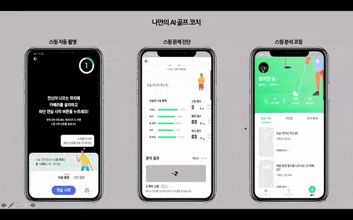

 

길었다면 길고 짧았다면 짧았던 6개월,

각자의 분야에 역량이 있는 멤버들로 구성된 제로백 팀이

"나샷!"을 개발했습니다.

### 🙌👏🙌👏🙌

# 골프, 스마트하게 연습할 수 없을까?

골프, 아무리 연습해도 쉽게 안 늘죠..

저는 요새 골프를 치면서 느끼는게  
레슨 받을 때는 참 잘되는데.. 혼자 연습할 때는 다시 망가지고  
이 사이클이 반복이 되는 것 같아 스트레스 받더라구요 ㅠ  

많은 분들이 저와 같은 고민을 하고 있을 거라 생각됩니다.

#### 저희 나샷은 이렇게 골프를 잘 치고 싶어하는 분들에게 고민을 덜어주고자 시작되었습니다!

 

# 나샷으로 골프 연습하자!

나샷은 인공지능으로 골프 스윙을 자동으로 인식, 녹화해 골프 스윙을 관리하고 스윙 자세를 분석해 혼자서도 똑똑한 골프 연습을 할 수 있도록 도와줍니다.

 

⛳️ **골프 스윙 자동 인식 및 녹화**

- 나샷 카메라를 켜고 전신이 녹화되도록 서주세요.
- 어드레스 자세를 인식하면 음성으로 스윙 시작 신호를 보냅니다.
- 시원하게 스윙 하세요. 나샷이 스윙 영상을 자동으로 저장해 기록해 드립니다.
- 정면, 측면, 45도 등 촬영 각도에 영향 없이 사용할 수 있습니다.
- 기록된 영상과 파노라마 사진은 저장해 지인들에게 자랑해 보세요~

 

⛳️ **골프 스윙 문제점 진단**

- 혼자 연습할 때 "이 자세가 맞나?"하는 생각 해보셨죠?
- 나샷은 자동으로 녹화된 스윙 영상을 8개의 구간으로 분류하고 10여가지 기준으로 분석해 문제점을 알려드립니다.
- 개인별 맞춤 솔루션 영상을 통해 문제점을 개선해 보세요!
- 갤러리 영상 분석 기능으로 저장해둔 스윙 영상으로도 분석받을 수 있습니다!

 

⛳️ **기타 기능**

- 스윙 영상 즐겨 찾기
- 통계 레포트
- 스윙 영상 및 파노라마 저장

 

# 간단한 사용 TIP

 

연습하고, 확인하고, 코칭받자!

나샷은 앞으로도 여러분의 골프 실력 고민을
해결하는 서비스가 되도록 노력하겠습니다.

사용해보시고 소중한 의견 주시면 감사하겠습니다.
