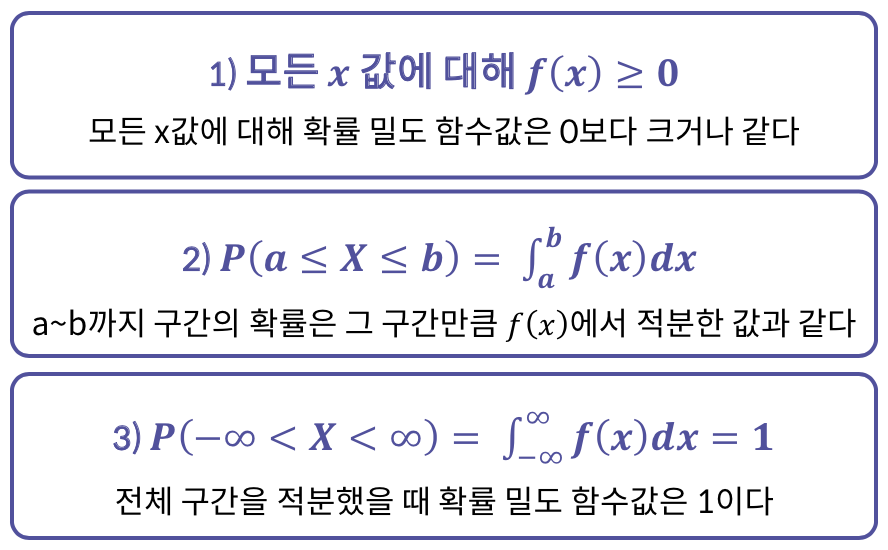

# 목차
1. [시각화를 통한 자료의 요약](#1-시각화를-통한-자료의-요약)
    * [자료의 형태](#-1-자료의-형태)
    * [범주형 자료의 요약](#-2-범주형-자료의-요약)
    * [수치형 자료의 요약](#-3-수치형-자료의-요약)
2. [논리적인 자료의 요약](#2-논리적인-자료의-요약)
    * [중심위치의 측도](#-1-중심위치의-측도)
    * [퍼진 정도의 측도](#-2-퍼진-정도의-측도)
    * [상자그림](#-3-상자그림)
    * [두 변수 자료의 요약](#-4-두-변수-자료의-요약)
3. [확률](#3-확률)
    * [사건과 확률의 개념](#-1-사건과-확률의-개념)
    * [순열과 조합](#-2-순열과-조합)
    * [독립과 조건부 확률](#-3-조건부-확률과-독립)
    * [확률분포](#-4-확률-분포)
4. [가설검정 및 추론](/#4-추론-및-가설검정)
    * [여러 가지 확률분포](#-1-여러-가지-확률분포)
    * [통계적 추론](#-2-통계적-추론)
    * [통계적 가설검정](#-3-통계적-가설-검정)
    * [검정의 종류와 과정](#-4-검정의-종류와-과정)

# 1. 시각화를 통한 자료의 요약

## 📌 **1. 자료의 형태**

### 자료의 형태

| 수치형 자료(Numerical data) | 범주형 자료(Categorical data) |
| :---------: | :---------: |
| 양적자료 | 질적자료 |
| 수치로 측정이 가능한 자료 | 수치로 측정이 불가능한 자료 |
| 예) 키, 몸무게, 시험점수, 나이 등 | 예) 성별, 지역 혈액형 등 |
| -> **선형 회귀 분석** 등 사용 | -> **로지스틱 회귀 분석** 등 사용 |

### 자료의 형태 구분 시, 주의점

* 범주형 자료와 수치형 자료의 구분 != 자료의 숫자 표현 가능 여부
* 범주형 자료가 숫자로 표현되는 경우
    - 남녀 성별 구분시, 1과 0으로 나타낼 때 숫자로 표현했지만 범주형자료
* 수치형 자료를 범주형 자료로 변환하는 경우
    - 나잇값은 수치형자료, 10~19세, 20~29세 등 나이대에 따라 구분화하면 범주형 자료

### 수치형 자료

* 연속형 자료(Continuous data)
    - 연속적인 관측값을 가짐
    - 예) 원주율, 시간 등
* 이산형 자료(Discrete data)
    - 셀 수 있는 관측값을 가짐
    - 예) 동영상 조회수

### 수치형 자료 구분

* 연속형 자료 != 이산형 자료
* 연속형 자료는 연속적인 관측
    - 09:12:23.21... -> 연속형 자료
    - 09시 12분 -> 이산형 자료

### 범주형 자료

* 순위형 자료(Ordinal data)
    - 범주 사이의 순서에 의미가 있음
    - 예) 학점(A+, A, A-)
* 명목형 자료(Norminal data)
    - 범주 사이의 순서에 의미가 없음
    - 예) 혈액형(A, B, O, AB)


## 📌 **2. 범주형 자료의 요약**

### 범주형 자료의 요약

이럴때
* 다수의 범주가 반복해서 관측됨
* 관측값의 크기보다 포함되는 범주에 관심이 있음

-> 범주형 자료의 요약이 필요하다.

**순서**
* 각 범주에 속하는 관측값의 개수를 측정
* 전체에서 차지하는 각 범주의 비율 파악
* 효율적으로 범주 간의 차이점 비교

### 도수분포표

|      |      |
| :--: | :--: |
| 도수(Frequency) | 각 범주에 속하는 관측값의 개수 |
| 상대도수(Relative Frequency) | 도수의 자료를 전체 개수로 나눈 비율 |
| 도수분포표(Frequency Table) | 범주형 자료에서 범주와 그 범주에 대응하는 도수, 상대도수를 나열해 표로 만든 것 |

### 도수분포표를 구하는 파이썬 코드

* 한가지 범주의 도수분포표

`pd.crosstab(index=범주, columns="count")`

* 다양한 범주의 도수분포표

`pd.crosstab(index=범주, columns=[또 다른 범주])`

### 도수분포표 예시


### 원그래프(Pie Chart)

`plt.pie(수치, labels=라벨)`

* 장점: 전체적인 분포를 이해하기 쉬운 그래프
* 단점: 범주 간 도수 비교 및 도수 크기 차이 파악이 어려움

### 막대 그래프(Bar Chart)

`plt.bar(수치, labels=라벨)`

* 장점: 각 범주가 가지는 도수의 크기 차이를 비교하기 쉬움
* 단점: 각 범주가 차지하는 비율의 비교가 어려움

### 코드

* 도수 계산하기: `value_counts()`

```python
import pandas as pd 
import numpy as np

# drink 데이터
drink = pd.read_csv("drink.csv")

# 도수 계산
drink_freq = drink[drink['Attend'] == 1]['Name'].value_counts()

print("도수 계산")
print(drink_freq)
```

* 상대도수 계산하기: `value_counts(normalize=True)`

```python
import pandas as pd 
import numpy as np

# drink 데이터
drink = pd.read_csv("drink.csv")

#상대도수 계산
drink_relfreq = drink[drink['Attend'] == 1]['Name'].value_counts(normalize=True)

print("상대도수 계산")
print(drink_relfreq)
```

* 도수분포표: `crosstab`

```python
import pandas as pd 
import numpy as np

# drink 데이터
drink = pd.read_csv("drink.csv")

# 전체 참석 횟수를 확인하는 도수분포표
drink_tab = pd.crosstab(index=drink['Attend'], columns='count')

print("전체 참석 횟수를 확인하는 도수분포표")
print(drink_tab)

#누가 몇 번 참석했는지 알 수 있는 도수분포표 
drink_who = pd.crosstab(index=drink['Attend'], columns=drink['Name'])

print("누가 몇 번 참석했는지 알 수 있는 도수분포표")
print(drink_who)
```

* 원형 그래프

```python
import matplotlib.pyplot as plt
# 술자리 참석 상대도수 데이터 
labels = ['A', 'B', 'C', 'D', 'E']
ratio = [33,25,17,17,8]
    
#원형 그래프 
fig, ax = plt.subplots()

## Q1. 원형 그래프를 만드는 코드를 작성해 주세요
plt.pie(ratio, labels=labels)

##
plt.show()
fig.savefig("pie_plot.png")
```

* 막대 그래프

```python
from elice_utils import EliceUtils
import matplotlib.pyplot as plt
elice_utils = EliceUtils()    
# 술자리 참석 상대도수 데이터 
labels = ['A', 'B', 'C', 'D', 'E']
ratio = [33,25,17,17,8]
    
#막대 그래프
fig, ax = plt.subplots()
## Q1. 막대 그래프를 만드는 코드를 작성해 주세요
plt.bar(labels, ratio)

##
plt.show()
fig.savefig("bar_plot.png")
elice_utils.send_image("bar_plot.png")
```

## 📌 **3. 수치형 자료의 요약**

### 이산형 자료의 요약

관측된 수치형 자료가 셀 수 있는 경우 > 이산형 자료 요약 

관측값의 종류 수가
* 많을 때 -> 범주형 자료 요약 기법
* 적을 때 -> 연속형 자료 요약 기법

### 연속형 자료 요약

수치형 자료가 연속적으로 관측 > 연속형 자료 요약

관측값의 종류 수가
* 많을 때 -> 연속형 자료 요약 기법
* 적을 때 -> 점도표, 도수분포표, 히스토그램, 상대도수다각형, 줄기-잎 그림

### 점도표(Dot diagram)

* 관측값의 개수가 상대적으로 적은 경우(20 또는 25이하) 사용
* 자료 전체의 개요를 파악할 수 있음
* 모든 자료를 나타낼 수 있도록 줄 위에 각 관측값을 점으로 표시
* 연속형 자료의 경우 중복된 정보를 판단하기 어렵기에, 자료를 크기에 따라 묶어서 분석하는 것이 효율적임


### 도수분포표(Frequency Table)

* 연속형 자료의 경우 구간(계급)으로 나누고, 각 구간마다 도수(관측값의 개수)로 작성
    * 계급: 위에서 나눈 구간
    * 계급구간: 각 계급에 포함되는 값의 범위
    * 계급구간의 폭: 계급구간의 크기

### 히스토그램(Histogram)

`plt.hist()`

* 연속형 자료의 도수분포표를 기반으로 각 계급을 범주로 사용
* 범주형 자료의 **막대그래프**와 같은 방식
* 자료의 분포를 알 수 있음


### 도수다각형

* 관측값의 변화에 따른 도수의 변화를 잘 나타냄
* 분포의 상태를 쉽게 파악
* 여러 자료를 비교하기 위해서는 도수다각형이 히스토그램보다 알맞음


### 줄기-잎 그림

`plt.stem(줄기, 관측값)`

* 함수 사용시 줄기값을 따로 지정해줘야함 : 줄기를 데이터마다 다르게 설정할 수 있기 때문
* 관측값에서 앞 단위와 뒷 단위를 정하고 앞단위는 줄기, 뒷단위는 잎으로 하여 기입
* 관측값의 개수가 지나치게 많거나 흩어져있으면 그리기 어려움


### 코드

* 히스토그램 그리기

```python
import numpy as np
import pandas as pd
import matplotlib.pyplot as plt

# 주량 데이터
drink_cup = pd.DataFrame({'cup' :[22,7,19,3,10,8,19,7,15,9,35,5],'who' : [ 'A', 'E', 'D', 'B', 'C','A','A','A','D','B', 'C','B'], 'stems' : [2,0,1,0,1,0,1,0,1,0,3,0]})

print(drink_cup)

fig, ax = plt.subplots()
## 히스토그램을 그리는 코드를 작성해 주세요
plt.hist(drink_cup['cup'])

##
plt.show()
fig.savefig("hist_plot.png")
```

* 줄기-잎 그림 그리기

```python
import numpy as np
import pandas as pd
import matplotlib.pyplot as plt
# 주량 데이터
drink_cup = pd.DataFrame({'cup' :[22,7,19,3,10,8,19,7,15,9,35,5],'who' : [ 'A', 'E', 'D', 'B', 'C','A','A','A','D','B', 'C','B'], 'stems' : [2,0,1,0,1,0,1,0,1,0,3,0]})

print(drink_cup)

fig, ax = plt.subplots()
## 줄기-잎 그림을 그리는 코드를 작성해 주세요
plt.stem(drink_cup['stems'], drink_cup['cup'])

##
plt.show()
fig.savefig("stem_plot.png")
```

# 2. 논리적인 자료의 요약

* 그림이나 도표에 의한 분석
    - 작성자의 주관적 판단에 따라 달라지므로 일관성/객관성 부족
    - 시각적 자료로는 이론적 근거 제시가 쉽지 않음
* 수치를 통한 연속형 자료 요약
    - 많은 양의 자료를 수치로 요약하여 분포상태를 파악 가능

### 수치를 통한 연속형 자료 요약

1. 중심위치의 측도(measure of center) : 자료의 중심위치를 나타냄
2. 퍼진 정도의 측도(measure of dispersion) : 자로가 각 중심위치로부터 얼마나 흩어져 있는지 나타냄
3. 도수분포표에서의 자료의 요약 : 자료가 이미 그룹화된 경우의 수치 요약 방법
4. 상자 그림 : 사분위수, 최소값, 최대값 등을 이용한 요약 방법

## 📌 **1. 중심위치의 측도**


### 중심 위치의 측도

1. 평균(Mean)

    `np.mean()`
    * 모든 관측값의 합을 자료의 개수로 나눈 것
    * 관측값의 산술평균으로 사용
    * 극단적으로 큰 값/작은값(이상치)의 영향을 많이 받음

2. 중앙값(Median)

    `np.median()`
    * 전체 관측값을 정렬했을 때 가운데에 위치하는 값
        * 자료의 개수(n)가 홀수인 경우 : (n+1)/2번째 관측값
        * 자료의 개수(n)가 짝수인 경우 : n/2번째, n/2+1번째 관측값의 평균
    * 가운데 위치한 값 이외의 값은 중요하지 않음. 관측값의 변화에 민감하지 않고, 극단값의 영향을 받지 않음

3. 최빈값(Mode)

    `from scipy import stats`

    `stats.mode()`

    `print(mode[0][0])`

    * 관측값 중 가장 자주 나오는 값
    * 이산형/범주형 자료에서 많이 사용, 연속형은 부적절
        - 연속형 자료에서 같은 값이 나오기는 쉽지 않음
    * 단봉형 대칭일 때 적절(평균=중앙값=최빈값)

### 평균, 중앙값, 최빈값의 비교

평균 > 중앙값 > 최빈값

극단값이 있는 경우
* 영향을 배제하려면 중앙값 사용
* 전체 관측값 포함하고 싶다면 평균 사용

단봉형 대칭


이봉형 대칭


비대칭 분포


## 📌 **2. 퍼진 정도의 측도**

중심위치만으로 분포를 파악하기에 부족
-> 분산, 표준편차, 번위, 사분위수 등을 퍼진 정도의 측도로 사용

### 분산

`from statistics import variance`
`variance()`

* 각 관측값이 자료의 평균으로부터 떨어진 정도
* 편차 = (관측값 - 평균)
    - 편차의 합은 항상 0
* 편차 제곱의 평균

### 표준편차

`from statistics import stdev`
`stdev()`

* 분산의 양의 제곱근

### 범위(Range)

`np.max()-np.min()`

* 간편하게 구할 수 있고 해석이 용이
* 중간에 위치한 값은 고려하지 않고, 극단값의 영향이 큼

### 백분위수

`np.percentile(리스트, [퍼센트])`

* 중앙값을 확장한 개념
* 자료를 순서대로 정렬했을 때 백분율로 특정 위치의 값을 표현 
* nxp
    - 정수일때 nxp와 nxp+1의 평균
    - 정수가 아닐때 nxp를 올림한 값 m번째 관측

### 사분위수

`np.percentile(25)` `np.percentile(50)` `np.percentile(75)`

* 전체를 사등분하는 값
* 제 1, 2, 3분위수를 각각 Q1, Q2, Q3로 표시
* 중앙값은 제 2사분위수

### 사분위수 범위

* 제 3사분위수와 1사분위수 사이 거리
    * 사분위 수 범위 IQR = 제 3사분위수 - 제 1사분위수
* 관측값의 중간 50%에 대한 범위

### 표준편차, 범위, 사분위수 범위 차이

* 평균의 특징 = 표준편차의 특징
* 중앙값의 특징 = 사분위수 범위의 특징

**표준편차**
* 관측값의 퍼진정도 골고루 반영
* 이상치에 영향을 많이 받음

**사분위수 범위**
* 극단값 영향없이 퍼진 정도 파악 가능
* Q1, Q3사이의 관측값 분포를 반영하지 않음

**범위**
* 퍼진정도를 나타냄
* 이상치 영향, 그 사이 관측값 분포를 반영하지 않음

### 변동계수

* 평균에 대한 상대적인 퍼진 정도
* 변동계수 CV = 표준편차/평균 * 100
* 비교 대상의 단위가 다른 경우, 변동계수를 통해 퍼진 정도 비교 가능

## 📌 **3. 상자그림**

### 도수분포표

자료가 도수분포표로 요약되고 원 자료는 주어지지 않을 경우
* 계급구간의 모든 관측값이 계급의 중간값을 갖는다고 가정하여 평균과 분산을 계산

**도수분포표에서 평균**


**도수분포에서의 분산, 표준편차**


### 상자그림

`plt.boxplot()`

* 최솟값, Q1, Q2, Q3, 최댓값을 그림으로 표현
* 단봉평 분포의 특징을 나타내는 데 적절
* 양봉형, 봉우리가 여러 개 있는 분포에서는 효과적인 분석이 어려움


### 코드

* 수치형 자료의 요약: 도수분포표

```python
import numpy as np
import pandas as pd

# 주량 데이터
drink_cup = pd.DataFrame({'cup' :[22,7,19,3,10,8,19,7,15,9,35,5],'who' : [ 'A', 'E', 'D', 'B', 'C','A','A','A','D','B', 'C','B']})

print(drink_cup)

# 도수분포표

factor_cup = pd.cut(drink_cup.cup, 4)
group_cup = drink_cup['cup'].groupby(factor_cup)
count_cup = group_cup.agg(['count'])

print(count_cup)
```

## 📌 **4. 두 변수 자료의 요약**

* 일반적인 자료요약
    * 하나의 변수 관측 -> 도표/수치로 요약
* 두 변수 자료의 요약
    * 둘 이상의 변수 관측 -> 동시에 분석하여 도표/수치로 요약

### 두 변수 자료의 요약

* 범주형 자료(Categorical data)
    - 분할표
* 수치형 자료(Numerical data)
    - 산점도, 공분산, 상관계수

### 분할표

`pd.crosstab(변수1, 변수2)`

* 범주형 자료, 두 변수 > 도수분포표를 2차원으로 확장한 형태로 요약
* 교차하는 부분에 여러 가지 값 표시 가능
    - 예) 상대도수 -> 두 변수 사이 관련 분포 상태를 명확히 표현


### 산점도: 그림을 통한 두 연속형 변수의 요약

`plt.scatter(변수1, 변수2)`

* 연속형 자료, 두 변수 > 각 변수의 관측값을 좌표평면에 표시
* 두 변수 사이의 관계를 시각적으로 파악


### 공분산

`변수가 포함된 자료.cov()`

* 두 변수(x, y)에 대하여 서로 어떤 관계를 가지는지 나타냄
    - x, y 같은 방향으로 변화 > 공분산 (+)
    - x, y 반대 방향으로 변화 > 공분산 (-)
* 두 변수의 편차를 곱하여 더한 후, 자료의 개수로 나누어줌
* 자료가 평균값으로부터 얼마나 멀리 떨어져 있는지 나타냄


### 상관계수(Correlation Coefficient)

`변수가 포함된 자료.corr()`

* 연속형 자료, 두 변수 > 산점도의 점들이 직선에 가까운 정도를 수치로 나타내어 관계를 파악
* 피어슨 상관계수라고도 불림, 보통 r로 표시
    * r > 0
    * r < 0
    * r = +1 : 모든 점이 정확히 기울기가 양수인 직선에 위치
    * r = -1 : 모든 점이 정확히 기울기가 음수인 직선에 위치
* 상관계수는 단위가 없음
    * 단위가 다른 변수에서 직선관계 정도 파악 가능
* 상관계수만으로 판단 시, 잘못된 해석 가능성
    - 직선관계가 아닐때 부적합
    - 산점도를 보고 경향 파악 후 상관계수 계산


### 상관계수와 인과관계

* 자료분석시, 큰 상관계수값이 항상 두 변수 사이의 인과관계를 의미한다고 생각하면 안됨!
* 상관계수가 높다 != 인과관계이다

### 코드

* 분할표

```python
import numpy as np 
import pandas as pd
import matplotlib as plt

# 데이터 불러오기
mart = pd.read_csv("mart.csv")
print(mart)

# Q1.지역별로 선호하는 마트
region_crosstab = pd.crosstab(mart['region'], mart['mart'])
print(region_crosstab)

# Q2. 가족구성원의 수별로 선호하는 마트
famnum_crosstab = pd.crosstab(mart['family_num'], mart['mart'])
print(famnum_crosstab)
```

* 산점도

```python
import matplotlib.pyplot as plt
import pandas as pd
# body.csv 읽어오기 
body = pd.read_csv("body_20.csv")

# Q1. 산점도 
##1-1 키와 몸무게간 산점도 
fig, ax = plt.subplots()
## 여기에 코드를 작성해 주세요
plt.scatter(body['height'], body['weight'])

##
plt.show()
fig.savefig("height_weight_plot.png")

##1-2 키와 체지방량 산점도 
fig, ax = plt.subplots()
## 여기에 코드를 작성해 주세요
plt.scatter(body['height'], body['body_fat'])

##
plt.show()
fig.savefig("height_fat_plot.png")

##1-3 키와 다리길이 산점도 
fig, ax = plt.subplots()
## 여기에 코드를 작성해 주세요
plt.scatter(body['height'], body['leglen'])

##
plt.show()
fig.savefig("height_leglen_plot.png")

##1-4 키와 모발 산점도 
fig, ax = plt.subplots()
## 여기에 코드를 작성해 주세요
plt.scatter(body['height'], body['hair'])

##
plt.show()
fig.savefig("height_hair_plot.png")
```

* 공분산

```python
from statistics import variance, stdev
import numpy as np 
import pandas as pd

# body.csv 읽어오기 
body = pd.read_csv("body.csv")

# 공분산
cov_body = body.cov()

print(cov_body)
```

* 상관계수

```python
from statistics import variance, stdev
import numpy as np 
import pandas as pd

# body.csv 읽어오기 
body = pd.read_csv("body.csv")

# 상관계수 
corr_body = body.corr()

print(corr_body)
```

# 3. 확률

## 📌 **1. 사건과 확률의 개념**

### 모집단과 표본

모집단(Population)
* 조사의 관심이 되는 전체 집단

표본(Sample)
* 모집단에서 일부를 표집(샘플링)히여 실제 조사한 대상

모수(Parameter)
* 모집단으로부터 계산된 모든 값, 미지의 수

통계량(Statics)
* 표보으로부터 계산된 모든 값, 모수를 추정

### 확률

* 여러 가능한 결과 중 하나 또는 일부가 일어날 가능성(0과 1사이의 값)

### 확률의 용어

실험(Experiment), 시행(Trial)

* 여러 가능한 결과 중 하나가 일어나도록 하는 행위

표본공간(Sample Space)

* 실험에서 나타날 수 잇는 모든 결과들을 모아둔 집합
* Ω 또는 S 로 표기

사건(Event)
* 표본공간의 일부분(부분집합)
* 사건 A가 일어날 확률: P(A) 또는 Pr(A)

복원추출
* 모든 시행에서 똑같은 상황으로 시행하는 방법

비복원추출
* 앞의 시행이 다음 시행에 영향을 주는 방법

### 확률의 주요 구성 요소


### 사건의 기본적인 연산

1. 여사건
    * A^c로 표시

2. 합사건
    * A∪B로 표시

3. 곱사건
    * A∩B로 표시

4. 배반사건
    * 동시에 일어날 수 없는 두 사건
    * A∩B=0인 두 사건

### 경우의 수 계산

**합의 법칙**
* 두 사건이 배반사건, 사건 A와 B가 일어나는 경우의 수가 각각 m과 n일 때 
* 사건 A 또는 B가 일어나는 경우의 수는 m+n

**곱의 법칙**
* 두 사건 A와 B가 일어나는 경우의 수가 각각 m과 n일 떄
* 두 사건 A와 B가 동시, 잇달아 일어날 때 경우의 수는 m*n

### 공리

* 증명을 필요로 하지 않거나 증명할 수 없지만 **직관적으로 자명한 진리의 명제**인 동시에 다른 명제들의 **전제**가 되는 명제

### 확률의 공리

* 모든 사건 A에 대하여 0 ≤ P(A) ≤ 1
* 표본공간 Ω에 대하여 P(Ω) = 1
* 서로 배반인 사건들의 전체 확률 = 각각의 확률을 더한 것


### 확률의 정리

1. P(A^c) = 1 − 𝑃(𝐴)
2. P(A∪B) = 𝑃(𝐴) + 𝑃(𝐵) − P(A∩B)
3. A ⊂ B일때, P(A) ≤ 𝑃(𝐵)

## 📌 **2. 순열과 조합**

### 순열

```python
from itertools import permutations
list(permutations([n], k))
```

### 조합

```python
from itertools import combinations
list(combinations([n], k))
```

### 중복순열

```python
from itertools import product
list(product([n], repeat=k))
```

### 중복조합

```python
from itertools import combinations
list(combinations_with_replacement([n], k))
```

## 📌 **3. 조건부 확률과 독립**

### 조건부 확률

* 특정한 사건의 확률을 구할 때, 다른 사건에 대한 정보가 주어지는 경우

* P(A|B) = P(A∩B) / P(B)
* P(A∩B) = P(A|B)P(A)

### 독립

* 일반적으로 두 사건은 서로 연관성이 있는 경우가 많음
* 조건부 확률은 두 사건의 연관성에 따라 달라짐
    - 사건 A, B 연관성 없음, P(A|B) = P(A)
    - 사건 A, B 연관성 있음, P(A|B) != P(A)
* 두 사건 A와 B가 서로 독립일 때
    - P(A∩B) = P(A) * P(B)

## 📌 **4. 확률 분포**

### 확률 변수

* 각각의 근원사건에 실수값을 대응시킨 함수
* X, Y, ... 처럼 대문자로 표시
* 시행을 하기 전엔 어떤 값을 갖게 될 지 알 수 없다는 불확실성을 표현


### 확률 분포

* 확률 변수가 가질 수 있는 값들이 무엇이고, 그 값을 가질 가능성 또는 확률이 어떻게 분포되어 있는지 나타낸 것

### 이산, 연속 확률 변수

**이산 확률 변수**
* 확률 변수의 값의 개수를 셀 수 있는 경우

**연속 확률 변수**
* 확률 변수의 값이 연속적인 구간에 속하는 경우

### 확률 질량 함수(PMF)


### 이산 확률 분포의 종류

베르누이 분포, 이항 분포, 기하 분포, 음이항 분포, 초기하 분포, 포아송 분포 ...

### 확률 밀도 함수(PDF)



### 연속 확률 분포의 종류

균일 분포, 지수 분포, 감마 분포, 정규 분포, 베타 분포 ...

### 누적 분포 함수(CMF, CDF)


# 4. 추론 및 가설검정

## 📌 **1. 여러 가지 확률분포**

### 확률 분포

**이산 확률 분포**
1. 베르누이 분포
2. 이항 분포
3. 기하 분포
4. 포아송 분포

**연속 확률 분포**
5. 균일 분포
6. 정규 분포

### 1. 베르누이 분포

* 베르누이 시행

    1. 각 시행은 성공과 실패 두 가지 중 하나의 결과를 가짐
    2. 각 시행에서 성공확률은 p, 실패 확률은 1-p
    3. 각 시행은 서로 독립, 각 시행의 결과가 다른 시행의 결과에 영향을 미치지 않음

* 베르누이 시행의 확률변수 X

### 2. 이항 분포

* 베르누이 시행을 반복했을 때, 성공하는 횟수의 확률분포
* 이항 실험 : 성공확률이 동일한 베르누이 시행을 독립적으로 반복하는 실험
* 이항 확률변수 : 전체 시행 중 성공의 횟수에 따른 확률변수


```python
stat_bin = scipy.stats.binom(n, p) # 이항 분포 확률 변수
stat_bin.pmf(x축) # 확률 질량 함수 시각화
stat_bin.cdf(x축) # 누적 분포 함수 시각화
np.random.binomial(n, p, size) # 이항 분포 랜덤 샘플
```

### 3. 초기하 분포

* 유한한 모집단에서 비복원 추출 시, 성공 횟수의 분포
* X: 표본 내에서 관심있는 범주(예: 불량품 개수)에 속하는 구성 원소의 수
* 모집단 크기가 M, 표본의 크기가 n, 관심이 있는 범주에 속하는 구성원소의 수가 N인 초기하 분포

`X ~ Hyper(M, n, N)`


```python
stat_hyp = scipy.stats.hypergeom(M, n, N)
stat_hyp.pmf(x축)
stat_hyp.cdf(x축)
np.random.hypergeometric(ngood, nbad, nsample, size)
```

* ngood(=n) : 모집단 중 관심있는 범주에 속하는 구성원소 수
* nbad(=M-n) : 관심있는 표본 이외의 개수
* nsample(=N) : 표본의 크기
* size : 표본 추출 작업 반복 힛수

### 4. 포아송 분포

* 단위시간/공간에 드물게 나타나는 사건의 횟수에 대한 확률 분포
* 연속적인 시간에서 매 순간 발생할 것으로 기대되는 평균 발생 횟수를 이용해 **주어진 시간에 실제로 발생하는 사건의 횟수** 분포
* 예시)
    - 일정 시간동안 발생하는 불량품의 수
    - 일정 시간동안 톨게이트를 지나는 차량의 수
    - 일정 페이지의 문장을 완성했을 때 발생하는 오타의 수
* 평균적으로 𝜆회 발생하는 사건의 발생 횟수에 대한 포아송분포

`X ~ Poi(𝜆)`


* 이항분포 B(n, p)에서 n이 매우 크고 p가 매우 작은 경우 𝜆=np인 포아송 분포로 근사 가능

### 5. 균일 분포

* 구간 [a, b]에 속하는 값을 가질 수 있고 그 확률이 균일한 분포
`X ~ U(a, b)`
* 예시)
    - 정육면체 주사위의 한 면이 나올 확률을 모두 1/6로 같음


```python
stat_uni = scipy.stats.uniform(a, b) # 균일 분포 확률 변수
stat_uni.pmf(x축) # 확률 질량 함수 시각화
stat_uni.cdf(x축) # 누적 분포 함수 시각화
np.random.uniform(a, b, n) # 균일 분포 랜덤샘플
```

### 6. 정규 분포

`N(m, σ^2)`


**표준 정규 분포**

* 𝜇 = 0, 𝜎 = 1로 둔 정규분포 Z 


```python
stat_nor = scipy.stats.norm(𝜇, 𝜎) # 정규 분포 확률 변수
stat_nor.pmf(x축) # 확률 질량 함수 시각화
stat_nor.cdf(x축) # 누적 분포 함수 시각화
np.random.normal(𝜇, 𝜎, n) # 정규 분포 랜덤 샘플
```


## 📌 **2. 통계적 추론**

* 표본이 갖고 있는 정보를 분석하여 모수를 추론
* 모수에 대한 가설의 옳고 그름을 판단
* 표본으로 전체 모집단의 성질을 추론하므로 오류 존재
    - 부정확도에 대한 언급이 있어야함

### 통계적 추론 방법

조사자의 관심에 따라 두 방법으로 구분됨

**모수 추정**
1. 모수에 대한 추론 혹은 추론치 제시
2. 수치화 된 정확도 제시

**가설 검정**
1. 모수에 대한 여러 가설들이 적합한지 표본으로 판단

### 모수 추정

**점추정**
* 추출된 표본으로부터 모수의 값에 가까울 것이 예상되는 하나의 값을 제시

**구간 추정**
* 하나의 값 대신 모수를 포함할 것이 예상되는 적절한 구간을 제시

### 모평균 점추정

**모집단의 모수인 평균 𝜇의 추정**
* 모집단에서 크기가 n인 표본을 n개의 확률변수 X1, X2, ..., Xn로 표현했을 때, 모평균의 추정량 중, 직관적으로 타당한 것은 표본평균


### 구간 추정

**신뢰 구간**
* 추정량의 분포를 이용하여 표본으로부터 모수의 값을 포함하리라 예상되는 구간
* (작은 값(하한), 큰 값(상한))의 형태

**신뢰 수준**
* 신뢰 구간이 모수를 포함할 확률을 1보다 작은 일정한 수준에서 유지할 때 확률이 신뢰수준
* 신뢰수준은 90%, 95%, 99% 등으로 정함

**모평균 𝜇의 신뢰구간**


## 📌 **3. 통계적 가설 검정**

### 가설 검정
* 모집단의 특성이나 모수에 대한 주장이 있을 때, 이 주장의 옳고 그름을 표본 자료를 이용하여 판단하는 방법
* 가설: 모수에 대한 주장
    - -> 통계적 가설 검정(검정): 주어진 가설을 표본 자료로부터 얻은 정보를 통해 검토하는 과정

### 귀무 가설과 대립 가설

**귀무 가설(H0, hypothesis)**
* 기본적인 가설

**대립 가설(H1, Alternative hypothesis)**
* 자료를 통하여 입증하고자 하는 가설
* 비교하고 싶은 가설

**예시)**


### 양측 가설과 단측 가설


### 통계적 가설 검정

* 귀무 가설과 대립 가설을 세워두고
    - 표본 자료가 대립 가설을 지지하면 대립 가설 채택
    - 표본 자료가 대립 가설을 지지하지 못하면 귀무 가설 채택
* 귀무 가설을 기준으로 한 표현 사용
    - 대립 가설 채택의 경우 : "귀무 가설 H0을 기각한다"
    - 귀무 가설을 채택하는 경우 : "귀무 가설 H0을 기각할 수 없다" or "귀무 가설 H0을 채택한다"

### 오류의 종류

**1종 오류(𝛼)**
* 귀무 가설이 참일 때 귀무 가설을 기각하는 경우

**2종 오류(β)**
* 귀무 가설이 거짓일 때 귀무 가설을 채택하는 경우


* 가설 검정은 표본 자료만으로 모집단에 대한 가설을 검토하므로 오류 존재
* 바람직한 가설 검정은 두 오류를 최소화하는 것이지만, 동시에 두 오류를 최소화하는 검정은 존재하지 않거나 찾기 어려움
* 1종 오류를 범할 확률과 2종 오류를 범할 확률은 반비례 관계

**1종 오류를 범할 때 더 큰 손실이나 비용이 발생하는 경우가 많음**


* 전통적인 통계학에서의 검정에서 1종 오류를 범할 확률을 우선 최소화하고, 이후 2종 오류를 범할 확률을 최소화 하는 것이 바람직

### 유의수준(Significance level, 𝛼)

* 1종 오류를 범할 확률에 대한 최대 허용 한계 고정값
* 일반적으로 유의수준 𝛼의 값으로 0.01~0.10 사이의 작은 값을 사용


## 📌 **4. 검정의 종류와 과정**

### 가설 검정 과정

1. 가설 검정
2. 표본 자료의 관측
3. 가설 검정에 사용할 통계량 선택(검정 통계량)
4. 관측값 계산
5. 기각역/유의 확률 계산
6. 검정 결과 해석 및 가설 채택

### 검정 통계량

* 가설 검정에 사용되는 통계량
* 가설 검정의 결과를 결정하는데 이용되는 표본의 함수
* 𝑋(표본평균)를 관측하여 그 값으로부터 𝜇에 대한 가설검정을 결정할 때 검정통계량으로 사용

### 검정을 위한 기준

1. 기각역
    * 𝑋(표본평균의 평균)가 취하는 구간 중에서 𝐻0을 기각하는 구간
    * R: 𝑋(표본평균의 평균) ≤ 𝑐 로 표현
        * 𝑋(표본평균의 평균)가 𝑐이하면 H0을 기각한다고 판단
    * 기각역의 올바른 선택이 검정의 가장 중요한 부분
    * 바람직한 기각역은 두 오류를 범할 확률을 최소화하는 것

2. 유의확률(p-value)

    * 표본 자료가 대립 가설을 지지하는 정도를 0과 1사이의 숫자로 나타낸 최소의 유의 수준 값
        - 높을 수록 귀무 가설을 채택
        - 낮을 수록 귀무 가설을 기각
    * P-value라고 부르기도 함
    * 표준 정규 분포표를 이용해 P값을 구해야 함

    

### 가설 검정 종류

1. 이항 검정
    * 이항 분포를 이용하여 베르누이 확률 변수의 모수 p에 대한 가설 조사
    * 베르누이 값을 가지는 확률 변수의 분포를 판단
    * 예) 어떤 동전을 던질 때, 앞면이 나올 확률 p=0.5인 동전이 공정한 동전인지 알아보는 검정
        - 귀무 가설: p=0.5
        - 대립 가설: p!=0.5

    ```python
    scipy.stats.binom_test(x, n, p, alternative='')
    # 이항 검정의 유의 확률을 구해주는 함수
    ```
    * x = 검정 통계량, 1이 나온 횟수
    * n = 총 시도 횟수
    * p = 모수 p 값
    * 양측 검정: alternative='two-sided'
    * 단측 검정: alternative='one-sided'


2. 모평균 가설 검정

    * 표본의 크기가 클 때, 모평균 𝜇이 정규 분포를 따른다는 가정하에 중심 극한 정리에 의해 정규 분포에 근사함

    

    

    ```python
    def ztest(stat, mu, sigma):
        z = (stat.mean() - mu) / (sigma*np.sqrt(len(stat)))
        return (2 * (1 - sp.stats.norm.cdf(z)))

    # 모평균 가설 검정 함수. 유의 확률 출력
    ```
    * stat: 검정 통계량
    * mu: 모평균
    * sigma: 모표준편차