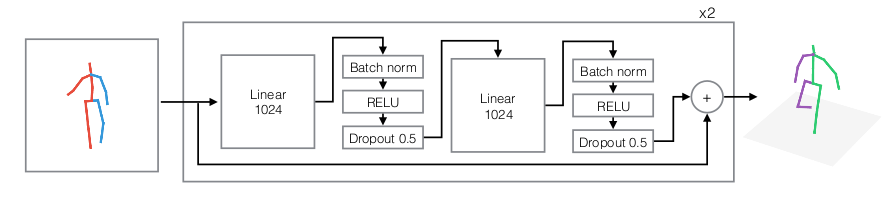

## 3D Pose Estimation 논문 서치 - Single-person 3D Pose

3D Pose Research에는 **두 가지 메인 어프로치**가 있다.

- first to estimate a 2D pose then reconstruct a 3D pose
- to regress a 3D pose directly.

### A simple yet effective baseline for 3d human pose estimation

2D pose를 추출한 뒤 3D pose로 estimate하는 방법.

- 2017년 ICCV 개제
- fully-connected network with residual connections
- Human3.6: Mean per Joint Position Error (MPJPE) is 64 mm
- light model

**프로젝트 인사이트**

- 본 논문에서는 2d joint location 정보만 가지고 3d로 매핑해준다.
  - CNN 없고 Linear한 학습
  - 원본 이미지를 추가하면 더 좋은 성능을 내지 않을까?
- lightweight network이기 때문에, 2d pose estimation 모델만 realtime이라면 full model이 realtime이지 않을까?
  - 단 full model의 performance를 높이려면, 2d 모델의 performance는 좋아야함.
  - 2d 모델을 pre-trained를 사용한다면, 데이터셋이 같고 클래스도 같아야함.
    - 안그러면 새로 트레인시켜야함..

## Distillation 논문 서치

### MobileNet V1 & V2

**Key Idea**

V1

- Channel Reduction
- Depthwise Seperable Convolution
  - Depthwise Conv(channel 분리) -> Pointwise Conv 하겠다.

V2

- Linear Bottlenecks
  - 1x1 convolution을 통해 채널 수 감소시킴 -> 3x3 Conv -> 1x1 채널 복구
- Inverted Residuals

### Fast Human Pose Estimation

- 2019년 CVPR 개제

**프로젝트 인사이트**

- Distillation할 때, 로스를 구하는 방법 참고해서 3차원으로 로스 만들면 어떨까?

  - Gaussian confidence map : 레이블 된 좌표의 분포를 만든다.
  - Lfpd = alpha _ Lpd + (1 - alpha) _ Lmse
  - ground truth - Children, Teacher - Children 간의 로스 구함.
  - Distillation을 짤 때, 3차원으로 분포를 만들면 좋을 것 같음.

- Distillation할 때, Teacher Network와 Student Network가 비슷한 구조여야 하는지?

  - 근거 1. 이 논문
    -> Hourglass가 포즈쪽에서 성능이 높은 걸로 알고 있음.
    -> 만약 뇌피셜이 맞다면, 다른 백본으로 된 포즈 모델을 찾아야함.
  - 근거 2. Improved Knowledge Distillation via Teacher Assistant

- hourglass와 Mobilenet과 엮을 수 있을지?
- Distillation하는 모델은 직접 짜야 할 것 같음!
