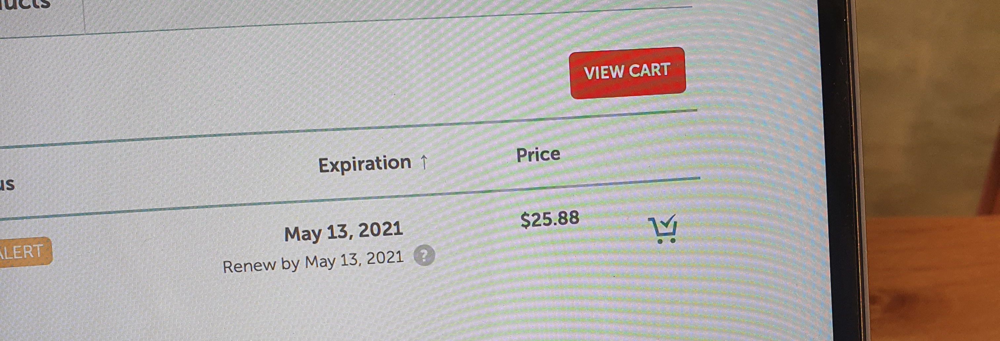
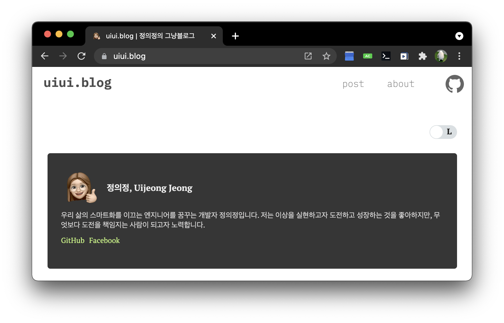

> 🤦🏻‍♀️ 블로그를 시작한 지 벌써 1년이 지났다. 이 글을 쓰기 전 마지막 포스팅이 무려 1월 6일인데 오늘은 무려 6월 11일이다.(WOW!) 사실상 방치되어 있던 블로그를 다시 시작해보기로 결심하였고, 지난달부터 틈틈이 `기술블로그`에서 `그냥블로그`로 개편을 진행하였다. 그런데 왜 `그냥블로그`냐고? 궁금한 이는 많지 않겠지만 `그냥블로그`로의 전환에 대한 내 생각 그리고 그 과정을 적어본다.

## 블로그 유지에 대한 고민 (by 도메인 연장)

모든 고민은 도메인 연장 메일로부터 시작되었다.

작년에 구매할 때에는 1만 원이었던 도메인 비용이 올해 3만 원으로 늘었던 것이다. 3배나 뛴 이 금액을 보고 고민이 많아졌다.

따지고 보면 얼마 안 하는 돈이다. 매월 구독료로 나가는 음악 스트리밍 서비스, 옷 대여 서비스, 중간에 그만둔 회화 앱, 그리고 의지에 가득 차서 결제해두었지만 만료되어 못 들은 인강까지.
여기에 쓴 비용을 생각하면 우주에서 본 먼지 한 톨 정도이다.

그렇다고 해서 과연 쿨하게 결제하는 게 맞는 것일까?

이 질문의 대답이 옳다는 상상을 해보았을 때, 매해 도메인 연장을 할 때마다 고민하는 내가 보였다.
매해 고정적으로 비용은 발생할 것이고, 작년 한 해를 두고 보았을 때 앞으로도 도메인 연장할 때마다 이런 고민을 반복할 가능성이 매우 높을 것이다.

하 진짜 그만둬? 🤦🏻‍♀️

## 다시 처음부터

초심으로 돌아가 봤다.

**왜 블로그 만들었더라. 블로그로 뭐하려고 했었지?**라는 고민을 정리해보았다.

1. [CV 혹은 PR을 위한 용도](/about)
2. 개발자라면 기술 블로그 하나쯤 있어야지 하는 자부심
3. 열심히 글 쓰면서 정리하면서 생각이 정리되는 기분
4. 자기표현의 용도?

블로그를 만들게 된 가장 큰 이유는 CV를 언제든지 웹상에서 확인할 수 있도록 만들어 놓는 것이었고, 두 번째 이유는 기술블로그는 개발자 국룰이니까(멋지잖아)

그리고 3번과 4번은 비슷한 이유인데, 콘텐츠가 마구 쏟아지는 세상에서 소비만 하는 것보다는 생성할 줄도 아는 사람이 되고자 했다. 리턴 값이 있는 함수랄까 ㅎㅎ

 

이러한 이유들을 제쳐두고 **왜 블로그를 꾸준하게 안 썼는가**에 대한 고민도 해보았다.

1. 대충 적기에는 압박감이 있음
2. 보기 좋게 정리할 때 시간 소요가 큼

가장 큰 이유로는 사실 TIL(Today I Learned)라는 일종의 학습을 정리하는 용도로 사용하고 싶었지만, 기술 블로그라는 멋진 타이틀 때문에 무언가 대충 적으면 안 될 것 같은 압박감 같은 게 있었다.

또 정리할 때면 시간이 너무! 오래 걸렸다.

TIL을 목적으로 할 때 남들이 보는 것보다도 내가 학습한 지식을 정리하는 데 초점을 둬야 하는데, 가독성과 형식을 신경 쓰다 보니 내용을 신경 쓰지 못하는 현상이 발생한 것이다.

결과적으로 꾸미기, 가독성과 형식에 신경 쓰느라 정작 포스팅을 못하고 지쳐 나가 떨어진 것이다! 🤦🏻‍♀️

## 그래서 그냥블로그!

정리를 해보고 나서 쿨하게(?) 결제를 할 수 있었다.

기술 블로그라는 점만 빼면 블로그의 존재가 나의 여러 가지 니즈를 충족시켰다. 결정에 가장 크게 기여한 건 CV인데, 구글 애널리틱스의 트래픽을 보면 메인 페이지 다음으로 가장 많이 본 페이지일 정도이다. 깃헙, 페이스북, 인스타에 URL을 걸어놓았더니 많이 들어오는 듯하다.

그래서 `기술블로그`를 `그냥블로그`로 개편하기로 했다. (HAPPY!)

## 그냥블로그에는

`그냥블로그`에는 그냥 내가 쓰고 싶었던 내용 위주로 적어볼 계획이다. 아래는 리스트이다.

1. 일상
2. TIL
3. 회고/TIP
4. 에러 모음집
5. 블로그에 관한 내용

거의 모든 항목이 내가 보려고 작성한 글일 것 같다. 이 포스팅같이 의미 없는 일상 글도 포함될 것 같고. ㅎㅎ 상업적인 가치는 없겠지만 이런 글을 쓰는 이유는 그냥 재미다. 모든 게 의미있을 필요는 없으니까! 글쓰기 연습? 정도 되려나.. 아주 약간은 관종이라 다이어리에 글을 쓰는 것보다는 조금 더 오픈된 공간에 내 자취가 덕지덕지 묻은 글을 쓰는 게 더 재밌는 것 같다.

## 소소하지만 야무진 계획

그럼에도 소소하지만 야무진 계획이 하나 있다.

불과 몇 초 전까지만 해도 재미다 뭐다 하며 욕심이 없다는 주장에 모순되는 계획이다. 바로 도메인 유지 비용 정도의 가치가 있는 블로그를 만드는 것이다. 그렇다 `3만 원은 벌겠지..`라며 아주 쉽게 생각하고 있지만 여러 가지 시도를 해볼 예정이다.

그래서 "블로그에 관한 내용"에는 블로그 트래픽 분석을 주기적으로 정리해볼까 생각하고 있다. 분석해보면서 어떤 게시글이 제일 노출이 많은지, 광고료가 많이 나오는지 등 확인해보는 것이다. 재밌겠다.. (물론 안 할 수도 있다.)

아무튼 이렇게 소소한 계획도 세웠다.

## 마무리

계획은 항상 야무지게.

이렇게 올려놓고 6개월 뒤에 다시 쓰러 올지도 모른다. 블로그 운영하는 친구의 표현을 빌려보자면, 블로그 N 수생이 될지도 모르는 일이다. 그럼에도 확신하는 건 꾸준히 글을 쓴다면 내적 성장에서의 가치로 보았을 때 돈의 가치인 3만 원을 훌쩍 넘어설 것이라는 점이다.

그러니까 이 야무진 계획 적당히 지켜봐야겠다! 끝
